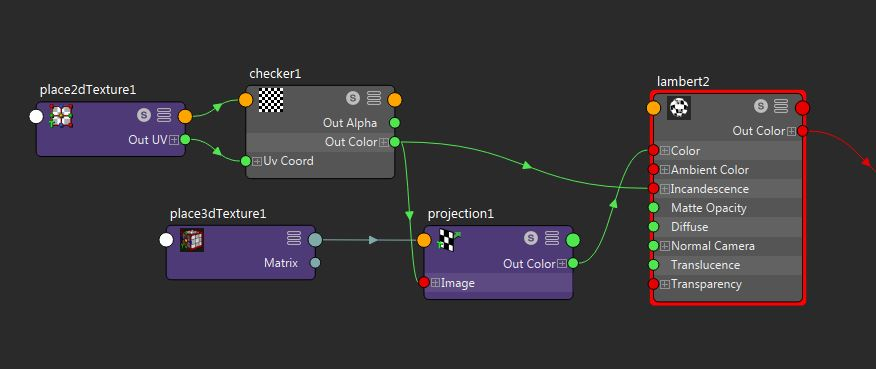

Limitations
===========

Geometry:

- appleseed does not allow to assign different shaders to instances, all instances of a geometry will always receive the shader of the original shape
- Only meshes (and smooth preview meshes) are supported. To render NURBS, you will have to convert them into meshes before rendering
- As mentioned above we have no support yet for hair, paintfx, volumes or xgen

Shading:

- Light colors in spot light and area lights cannot yet be mapped
- Displacement is not yet supported
- Not all shaders are translated to OSL, please have a look at the supported node list :doc:`features <../features>`
- Textures used with a projection node should not be used in other projection nodes or for normal uv texturing. A connection from the checker texture to the projection node and the incandescence attribute as shown in the image below needs two different uv coordinates which is not supported at the moment:

